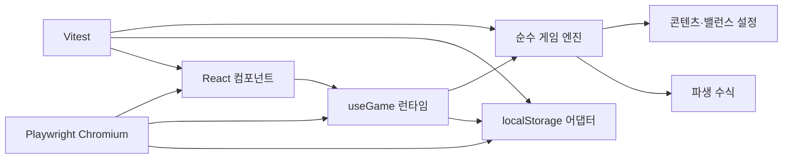

# 기술 아키텍처

## 1. 방향

React는 화면과 브라우저 생명주기만 담당하고, 게임 규칙은 DOM·타이머·저장소를 모르는 순수 TypeScript 함수로 유지한다.



의존 방향은 `UI → 런타임 → 도메인`이며, `src/game`은 React를 import하지 않는다.

## 2. 상태 계약

`GameState`는 저장 가능한 최소 상태만 가진다.

- `schemaVersion`, `lastSavedAt`, `claimedBossMilestoneMask`, `expeditionEvents`
- `rng`: `xorshift32-v1` 최초 seed, 현재 uint32 state, 누적 draw 횟수
- `player`: 레벨, 경험치, 자원, 현재 HP, 강화·스킬 랭크와 영입 동료·원정 랭크
- `battle`: 현재·최고 스테이지, 적 HP, 라운드 나머지 시간, 영웅·동료 쿨다운, 승패 통계
- `stats`: 평생 골드, 처치, 환생

공격력, 최대 HP, 방어력, 적 능력치, 강화 비용은 저장하지 않고 selector 성격의 순수 함수로 매번 파생한다. 콘텐츠 조정 뒤 오래된 저장에도 새 밸런스가 일관되게 적용된다.

## 3. 상태 전이

핵심 API는 다음과 같다.

```ts
createInitialState(now, seed?): GameState
advanceGame(state, elapsedMs, startCursor?): AdvanceResult
mergeCombatEventBatches(left, right): CombatEventBatch
purchaseUpgrade(state, id): CommandResult
upgradeSkill(state, id): CommandResult
recruitCompanion(state, id): CommandResult
trainCompanion(state): CommandResult
selectStage(state, stage): CommandResult
performPrestige(state): CommandResult
chooseExpeditionEvent(state, eventId, choiceId): CommandResult
```

- 입력 상태를 수정하지 않고 복제한 다음 새 상태를 반환한다.
- 명령은 성공 여부와 사용자 메시지를 함께 반환한다.
- 전투 보고서는 UI 알림과 오프라인 결과에 쓰며 영속 상태에는 저장하지 않는다.
- 전투 이벤트는 `skill`, `critical`, `companionAssist`, `kill`, `bossVictory`, `defeat`의 비영속 discriminated union이다. 같은 round는 `skill(10) → critical(20) → companionAssist(25) → outcome(30)` 순서를 고정하며 협공 이벤트는 적용 피해와 동료 ID를 즉시 snapshot으로 남기되 RNG draw와 보상 분기를 추가하지 않는다. 브라우저 생명주기는 canonical decimal cursor와 최근 100개 queue만 메모리에 보유한다. bootstrap·reset·import·writer/reader 재동기화에서 batch를 폐기하고 비영속 `combatEventGeneration`을 증가시켜 UI consumer가 새로 0부터 시작하는 좌표를 이전 원정과 구분한다.
- 전투 로그 UI는 queue의 마지막 20개를 먼저 고정한 뒤 메모리 filter를 적용한다. 보이는 ordered list는 live region이 아니며, 별도 atomic polite region만 첫 새 이벤트부터 5초 고정 window로 유형별 건수를 한 번 발표한다. 로그·filter·접힘·announcement 상태는 저장 경계 밖이다.
- 이벤트 cursor는 RNG draw 수와 분리해 완성된 라운드마다 BigInt로 증가한다. ID는 round sequence, draw 직후 RNG state, 고정 ordinal과 type으로 만들며 단일·분할 실행에서 같다.
- `mergeCombatEventBatches`는 round sequence를 문자열이 아닌 수치로 정렬하고 좌표·payload 충돌을 거부한다. UI는 이벤트 snapshot을 표시만 하며 보상을 다시 지급하지 않는다.
- 전투 라운드마다 저장된 `xorshift32-v1` state를 정확히 한 번 전진시킨다. 같은 RNG state·게임 상태·경과 시간은 치명타 순서와 최종 결과가 같으며, 동료 협공·UI·비전투 명령은 RNG를 호출하지 않는다.
- 라운드 공격 순서는 `영웅 → 생존 시 준비된 동료 → 생존 시 적 반격`이다. 사망 판정과 보상은 두 공격 뒤 공통 분기 하나에서만 실행한다.
- 보스 공통 처치 분기는 반복 처치 골드를 먼저 적용한 뒤 `boss-milestone-v1`의 미수령 milestone 골드와 30-bit claim을 한 상태 전이로 처리한다. `bossVictory` 이벤트의 반복 골드 필드는 유지하고 최초 지급 내역은 `{ tableId, kind, milestoneStage, configuredGold, appliedGold }` snapshot으로 별도 기록하며, 이미 받은 보스는 `null`을 기록한다.
- 승패 결과 consumer는 `bossVictory`·`defeat`만 좁은 frozen snapshot으로 복사하고 BigInt 좌표 이하를 재처리하지 않는다. 같은 generation의 최신 3개와 실제 eviction 수만 메모리에 두며, 사용자 선택으로 연 상세 snapshot은 queue와 분리해 pin한다. 보이는 list와 최신 한 건 atomic polite announcement를 분리하고 art는 dialog open 때만 로드한다. UI에는 게임 상태나 보상 명령을 전달하지 않는다.

## 4. 게임 시간

```text
250ms 브라우저 pulse
  → 실제 Date.now 차이 계산
  → 경과 시간을 advanceGame에 전달
  → 1초 미만 나머지를 GameState에 보존
  → 완성된 라운드만 처리
```

`setInterval` 호출 횟수를 게임 시간으로 사용하지 않는다. 백그라운드 탭에서 타이머가 지연되어도 다음 pulse가 실제 차이를 처리한다. 5초마다 저장하고 `visibilitychange(hidden)`와 `pagehide`에서도 정산 후 저장한다.

`debugSimulator`는 같은 순수 엔진을 1·10·100초 청크로 호출하는 헤드리스 검증 도구다. 배속은 게임 규칙이나 RNG 소비량을 바꾸지 않으며 snapshot 경계를 넘지 않도록 청크를 분할한다. 24시간 soak는 오프라인 8시간 상한을 무시하는 단일 호출이 아니라 8·16·24시간 경계의 전체 상태와 누적 보고를 비교한다.

브라우저 개발자 패널은 `import.meta.env.DEV` 분기 안에서만 동적 import한다. production graph에는 debug component·adapter·CSS·활성화 trigger가 없다. 진입 시 정상 `useGame` tree를 먼저 unmount해 writer를 해제한 다음 별도 commit에서 `bootstrapGame(..., 'reader')` snapshot의 메모리 복제본을 연다. 세션 marker는 sessionStorage read-back이 확인될 때만 유효하며, debug tree는 writer lock·autosave·pagehide save·가져오기 API를 참조하지 않는다. 실시간 배속은 실제 경과시간을 검증된 1x·10x·100x와 8시간 상한으로 환산하고, offline fixture는 순수 `debugSimulator`를 사용한다.

## 5. 저장과 복구

- legacy 키: `emberwatch.save.v1`
- 현재 슬롯: `emberwatch.save.v2.a`, `emberwatch.save.v2.b`
- 현재 writer envelope: `{ formatVersion: 3, revision, savedAt, state }`; A/B localStorage key 이름은 호환을 위해 `v2.a/b`를 유지한다.
- reader는 raw·envelope의 GameState schema1·2·3을 검증해 메모리에서 schema4로 변환하고, writer만 반대 슬롯에 revision+1의 envelope v3/schema4 checkpoint를 기록한다. envelope format v3와 현재보다 높은 inner state schema는 구버전 writer의 덮어쓰기를 막는 차단 장벽이다.
- 읽은 JSON은 `unknown`에서 시작해 숫자 범위와 필수 중첩 구조를 검사한다.
- 스테이지, HP, 라운드 나머지와 화염 강타 쿨다운은 현재 콘텐츠 범위로 정규화한다.
- 유효 envelope 중 가장 높은 revision을 선택한다. 동률이면 `savedAt`, 그래도 같으면 A 슬롯을 우선하며 상태를 필드별로 병합하지 않는다.
- 저장은 현재 승자의 반대 슬롯에 `revision + 1`을 쓰고 같은 원문을 즉시 재읽어 decode한 뒤에만 성공으로 판정한다. 이전 승자는 건드리지 않는다.
- 최신 슬롯이 손상되면 이전 유효 슬롯로 복구한 뒤 손상 슬롯을 새 revision으로 치유하고 화면에 경고한다.
- legacy v1 raw `GameState`는 decode·정규화 후 envelope v3/schema4 A/B 기록이 검증된 경우에만 제거한다.
- 알 수 없는 미래 envelope `formatVersion`, envelope 내부 state schema, legacy raw state schema 중 하나라도 발견하면 구버전·현재 클라이언트가 덮어쓰지 않도록 모든 저장을 차단한다.
- 저장 실패는 게임 루프를 중단시키지 않고 상태 표시로 노출한다.
- 브라우저는 `emberwatch.writer.v1` Web Lock을 bootstrap 전에 획득한 한 탭만 writer로 사용한다. 다른 탭은 오프라인 정산·tick·명령·저장 없이 검증된 최신 슬롯을 표시한다.
- writer는 마지막 성공 revision을 추적하고 모든 쓰기에 기대 revision을 전달한다. 불일치나 동일 revision의 divergent 상태는 슬롯을 바꾸지 않고 거부한다.
- reader는 `storage` 이벤트로 최신 snapshot을 반영하며 1초마다 lock 인계를 재시도한다. Web Locks 미지원 환경은 데이터 보호를 위해 읽기 전용이다.
- 진행 초기화는 키를 물리적으로 지우지 않고 초기 상태를 연속 두 revision으로 기록해 단조 revision과 A/B 복구본을 모두 유지한다.
- portable backup v1은 `{ kind, exportVersion, exportedAt, state, checksum }` JSON이며 local envelope revision을 포함하지 않는다. parser는 1 MiB 상한, checksum, 공용 state decoder를 모두 통과한 뒤에만 preview를 만든다.
- import는 preview 확인 시점에도 checksum과 schema를 재검증하고 기대 local revision으로 반대 슬롯에 기록한다. 외부 revision을 복사하지 않으며 `lastSavedAt`을 확인 시각으로 옮겨 과거 오프라인 구간을 재생하지 않는다.
- target write 뒤 read-back이 실패하면 쓰기 전 target 원문을 복원해 실패한 import가 다음 bootstrap의 winner가 되지 않게 한다.

schema migration registry는 GameState schema1을 고정 필드 순서의 FNV-1a seed와 RNG state가 있는 schema2로 변환한다. raw legacy, envelope v2, portable export v1은 같은 decoder를 사용하며 새 시각이나 알 수 없는 필드를 seed에 섞지 않는다. checked-in raw/portable schema1 fixture는 이후 버전에서도 회귀 대상으로 유지한다.

IRPG-108은 GameState schema2를 schema3으로 변환해 `player.companion`과 `battle.companionCooldownMs`를 추가한다. schema1은 기존 결정론적 RNG migration을 먼저 거친 뒤 같은 기본 동료 상태를 받는다. 기존 `formatVersion: 3 / schemaVersion: 2` A/B 슬롯도 손상으로 오인하지 않고 메모리에서 변환하며, writer만 반대 슬롯에 새 revision의 schema3 checkpoint를 기록한다.

IRPG-207은 GameState schema1·2·3을 schema4로 변환해 top-level `claimedBossMilestoneMask`를 추가한다. 환생 기록이 없으면 `min(30, floor(min(300, highestStage) / 10))`개의 하위 bit를 과거 지급분으로 보수적으로 waive하고, 환생 기록이 있으면 30개 bit를 모두 waive한다. schema3의 RNG·동료·cooldown은 보존하고 동명 legacy 필드는 신뢰하지 않는다. schema4 mask는 `0..2^30-1` safe integer를 필수로 검증하며 누락·음수·소수·초과 값은 보정하지 않고 저장을 거부한다. checked-in schema3 fixture와 A/B·portable 회귀가 이 경계를 고정한다.

IRPG-107은 schema5에서 top-level `expeditionEvents = { runPrestige, milestoneMask, pending, overflowCount }`를 추가한다. `milestoneMask`는 현재 원정 stage 10~300의 30개 bit이며 pending은 최대 3개다. 각 pending은 canonical event ID, definition ID/version, milestone index/stage, 발동 당시 최대 HP, 이미 정수로 확정된 두 선택 효과를 보관한다. definition shuffle은 저장 seed·run·3-milestone block으로 만든 임시 substream만 사용해 `rng.state`와 `rng.draws`를 바꾸지 않는다. 생성은 milestone bit 소비와 pending 추가 또는 overflow 증가를, 선택은 검증된 단일 effect 적용과 pending 제거를 각각 하나의 cloned state transaction으로 처리한다.

schema1~4 migration은 `runPrestige = stats.prestiges`, `milestoneMask = highestStage 이하 milestone 전체 소비`, `pending = []`, `overflowCount = 0`으로 초기화해 소급 보상을 막는다. schema5 decoder는 run 불일치, mask 범위 초과, pending 3개 초과, 중복 ID/index, 소비되지 않은 pending bit, 알 수 없는 definition/effect, 안전 범위를 벗어난 resolved amount를 보정하지 않고 거부한다. A/B key·envelope format3·portable exportVersion1은 유지하고 inner schema5 future fence로 구버전 덮어쓰기를 막는다. exact-once 범위는 선택된 로컬 A/B 계보이며 과거 portable 복원은 pending과 지급 자원을 함께 rollback할 수 있다.

Playwright는 저장 키나 도메인 함수를 직접 호출하지 않는다. 격리된 브라우저 context에서 고정된 `Date.now`와 실제 UI 명령을 사용해 신규 시작, 강화, reload, 페이지 종료, 오프라인 정산을 검증한다. 따라서 React 생명주기와 A/B localStorage 경로를 함께 통과한다.

## 6. 불변식

- HP, 경험치, 재화, 쿨다운, 통계는 유한하고 0 이상이다.
- 누적 자원·경험치·카운터·보고와 1회 피해·보상은 최대 안전 정수에서 포화해 유효 저장이 다음 전투 뒤 저장 불가 상태가 되지 않는다.
- 현재 스테이지는 `1..MAX_STAGE`, 최고 스테이지 이하이다.
- 적 HP는 현재 적 최대 HP 이하이며 로드 후 최소 1이다.
- 구매는 비용이 충분할 때만 차감과 레벨 상승을 함께 수행한다.
- 보상은 한 처치 분기에서 한 번만 지급한다.
- `claimedBossMilestoneMask`는 `0..2^30-1`의 안전한 정수이며 환생에서도 유지된다. 최대 골드에서 milestone의 실제 증가량이 0이어도 claim은 완료해 재시도 복제를 막는다.
- `expeditionEvents.runPrestige`는 `stats.prestiges`와 같고 mask·pending·overflow는 현재 원정에만 속한다. pending full 상태도 milestone bit를 소비하며 환생은 pending을 보상 없이 폐기하고 run을 증가시킨다. 최대 안전 정수 prestige에서는 동일 run ID 재사용을 막기 위해 환생을 거부한다.
- 미영입 동료는 `id=null, rank=0`, 영입 동료는 `id=emberFox, rank=1..5`이며 cooldown은 `0..3000ms`다.
- 동료 협공은 라운드당 최대 한 번이고 RNG draw를 추가하지 않는다.
- 오프라인 경과 시간은 8시간을 넘지 않고 음수가 아니다.
- 환생 유지·초기화 필드는 명시적으로 분리한다.

## 7. 시각 자산 경계

- `src/assets/game/manifest.json`이 안정 ID, 용도, 배포 파일, 픽셀·바이트 상한과 권리 metadata의 단일 출처다.
- 브라우저 resolver는 `import.meta.glob`의 지연 loader로 로컬 WebP/SVG만 해석한다. 요청 자산이 없거나 load/decode에 실패하면 용도별 SVG, 다시 실패하면 고정 크기 CSS fallback으로 내려가며 전투와 저장을 중단하지 않는다.
- 최초 전투 화면은 현재 영웅과 현재 적만 eager로 요청한다. 지역·카드·이벤트 및 다른 전투 대상은 실제 표시 직전에만 로드하고, 승패 result art는 사용자가 상세 dialog를 열 때만 요청한다.
- production cold load는 고유 로컬 URL을 `dist` 파일로 해석해 gzip level 9 합계를 계산하며 600 KiB를 넘지 않는다. 작은 자산도 JS data URL로 섞이지 않도록 Vite asset inline을 비활성화한다.
- `GameState`와 portable backup에는 asset ID, 파일 경로, 이미지 상태를 저장하지 않는다. 적 정의의 안정 ID는 저장되지 않는 콘텐츠 설정이며 기존 전투 수식과 RNG 소비에 영향을 주지 않는다.

## 8. 확장 지점

- 콘텐츠: `content.ts`의 데이터 정의와 적 생성기
- 경제: `formulas.ts`
- 신규 명령: `engine.ts`의 순수 `CommandResult`
- 저장 교체: `StorageLike` 계약을 구현하는 IndexedDB/서버 어댑터
- 대규모 오프라인 계산: 이벤트 점프 알고리즘 또는 Web Worker
- 서버 운영: 인증·서버 시간·보상 멱등 키·원격 콘텐츠 버전이 선행 조건
