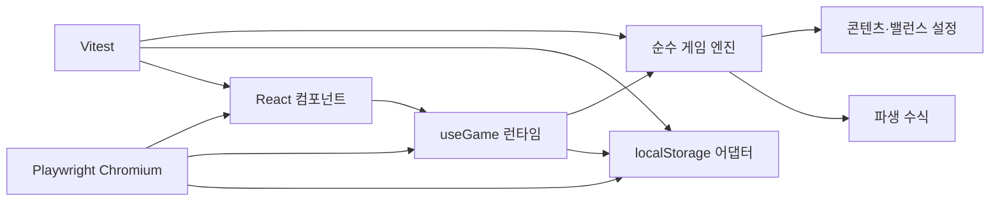

# 기술 아키텍처

## 1. 방향

React는 화면과 브라우저 생명주기만 담당하고, 게임 규칙은 DOM·타이머·저장소를 모르는 순수 TypeScript 함수로 유지한다.



의존 방향은 `UI → 런타임 → 도메인`이며, `src/game`은 React를 import하지 않는다.

## 2. 상태 계약

`GameState`는 저장 가능한 최소 상태만 가진다.

- `schemaVersion`: 9 (`SAVE_VERSION`)
- `lastSavedAt`, `currentMode`, `claimedBossMilestoneMask`, `expeditionEvents`
- `rng`: `xorshift32-v1` 최초 seed, 현재 uint32 state, 누적 draw 횟수
- `player`: 레벨, 경험치, 자원, 현재 HP, 강화·스킬 랭크와 영입 동료·원정 랭크, 부위별 장착 장비(`equipped`: `weapon`, `armor`, `helmet`, `accessory`), 3슬롯 능동 스킬 배치(`skillSlots`)
- `inventory`: definition version 1, 삼원 인벤토리 공간(`lootBag`, `heroInventory`, `campStorage`: `Record<ItemId, number>` 수량 맵)
- `battle`: 현재·최고 스테이지, 적 HP, 라운드 나머지 시간, 영웅·동료 쿨다운, 승패 통계
- `camp`: definition version, Lv.1~5 시설, 시설별 상한 안의 영구 훈련 rank, 재료·소모품·빠른 슬롯·제작·버프·상인·거주자와 `bond` 상태. schema9는 schema8 원장을 보존하며 고정 `ITEM_REGISTRY` 참조형 삼원 인벤토리·부위별 장비·스킬 슬롯 원장만 추가한다.
- `stats`: 평생 골드, 처치, 환생

공격력, 최대 HP, 방어력, 치명타 확률, 적 능력치, 강화 비용은 저장하지 않고 고정 `ITEM_REGISTRY` 및 selector 성격의 순수 함수로 매번 파생한다. 콘텐츠 조정 뒤 오래된 저장에도 새 밸런스가 일관되게 적용된다.

## 3. 상태 전이

핵심 API는 다음과 같다.

```ts
createInitialState(now, seed?): GameState
advanceGame(state, elapsedMs, startCursor?): AdvanceResult
advanceOfflineGame(state, elapsedMs, startCursor?): AdvanceResult
mergeCombatEventBatches(left, right): CombatEventBatch
switchGameMode(state, mode): CommandResult
settleLootAtCamp(state): GameState
equipItem(state, slot, itemId): CommandResult
unequipItem(state, slot): CommandResult
moveItem(state, source, target, itemId, amount): CommandResult
upgradeCampStructure(state, id): CommandResult
trainAtCamp(state, id): CommandResult
startCampCraft(state, recipeId): CommandResult
consumeCampConsumable(state, id): CommandResult
healAtCamp(state): CommandResult
equipQuickConsumable(state, id): CommandResult
useEquippedConsumable(state): CommandResult
purchaseCampMerchantOffer(state, slot): CommandResult
acceptSeraContract(state): CommandResult
increaseSeraTrust(state): CommandResult
setAdultContentAccess(state, confirmed): CommandResult
setSeraBondConsent(state, consent): CommandResult
selectCampCostume(state, costumeId): CommandResult
synthesizeJointBond(state, synthesisId): CommandResult
purchaseUpgrade(state, id): CommandResult
upgradeSkill(state, id): CommandResult
recruitCompanion(state, id): CommandResult
trainCompanion(state): CommandResult
selectStage(state, stage): CommandResult
performPrestige(state): CommandResult
chooseExpeditionEvent(state, eventId, choiceId): CommandResult
```

- 입력 상태를 수정하지 않고 복제한 다음 새 상태를 반환한다.
- 명령은 성공 여부와 사용자 메시지를 함께 반환한다.
- `switchGameMode`는 저장되는 `BATTLE`·`CAMP` 값을 바꾸고 `CAMP` 진입 시에만 `settleLootAtCamp`를 같은 transaction에서 호출한다. 전투 snapshot·RNG와 전리품 이외 재화에는 손대지 않으며 같은 모드로의 중복 명령은 상태를 바꾸지 않고 거부한다.
- `advanceGame`은 `CAMP`에서 전경 전투를 완전히 우회해 라운드·RNG·보상·스테이지·event cursor를 진행하지 않는다. bootstrap 전용 `advanceOfflineGame`은 clone을 `BATTLE`로 정산한 뒤 입력 활동 모드를 복원한다.
- `upgradeCampStructure`와 `trainAtCamp`는 `CAMP`에서만 실행한다. 비용·상한을 입력 상태에서 검증한 뒤 clone에서만 골드 차감과 단계 증가를 함께 적용하므로 거절은 동일 객체와 revision을 보존하고 성공은 하나의 저장 transaction이 된다.
- 시설·훈련의 단일 출처는 `camp.ts`의 `camp-facilities-v1` 상수와 selector다. 시설 비용은 텐트 `[600, 1500, 3600, 8000]`, 작업대 `[450, 1100, 2700, 6200]`, 단련소 `[500, 1250, 3000, 7000]`이고, 훈련 비용은 공격 `round(140 × 1.45^rank)`, 체력 `round(160 × 1.45^rank)`다. 모든 비용은 1 이상 안전 정수로 포화한다.
- 파생 능력치는 기존 정수 영구 multiplier 계산 뒤 공격 훈련 `rank × 2`, 체력 훈련 `rank × 20`을 마지막 flat 항으로 더한다. 체력 훈련 transaction은 증가한 최대 HP만큼 현재 HP도 새 상한 안에서 회복한다.
- `camp.ts`의 finite material·recipe table이 재료 지급과 제작 비용의 단일 출처다. 모든 처치는 `ashShard +1`, `enemy.twilight-wolf` 처치는 추가 `beastHide +1`, 보스 처치는 추가 `emberCore +1`을 지급한다. 이 분기는 stable enemy definition만 읽으며 전투 RNG draw를 추가하지 않는다.
- `itemRegistry.ts`의 deep-frozen `ITEM_REGISTRY`는 장비 정의의 단일 출처이고 `lootRegistry.ts`의 deep-frozen `EQUIPMENT_LOOT_REGISTRY`는 `equipment-loot-v1` 드롭 table의 단일 출처다. 일반 적은 처치마다 전용 substream의 첫 draw가 0.15 미만일 때 COMMON 4종 중 하나를 다음 draw로 균등 선택하고, 보스는 처치마다 첫 draw로 RARE 3종 중 하나를 균등 선택한다. 반복 보스 처치도 매번 지급하며 최초 승리 원장과 결합하지 않는다.
- 장비 드롭 substream seed는 저장 seed·처치 ordinal·처치 stage·보스 여부의 안정 encounter identity에서 파생하며 저장된 전투 RNG 객체를 읽거나 전진시키지 않는다. 전투 라운드는 기존 1 draw/round만 진행하고 드롭 로직은 추가 draw를 소비하지 않는다. 동일 입력의 단일·분할·오프라인·reload 경로는 같은 ID·수량을 만든다.
- `settleLootAtCamp`는 `campStorage`의 ID별 안전 정수 여유만큼 `lootBag`에서 이관하고 포화로 옮기지 못한 나머지를 원래 ID에 남긴다. `moveItem`도 요청량과 대상 여유의 최소값만 원자 이동한다. `equipItem` 교환과 `unequipItem`은 반환될 기존 장비를 `heroInventory`에 넣을 공간이 없으면 입력 객체를 그대로 반환해 총량을 보존한다.
- 장착 장비의 `atk`·`hp`·`def`는 파생 능력치의 마지막 flat 항이며 `critChanceBasisPoints / 10,000`은 일반 치명타 확률에 더한다. 장착·해제는 현재 HP를 증가시키지 않고 `min(currentHp, newMaxHp)`만 적용한다. 집중 물약이 bound된 보스는 장비 보너스와 무관하게 최종 임계값 0.35를 사용한다.
- `performPrestige`는 `inventory` 세 공간, `equipped` 네 부위와 고정 tuple `skillSlots` 세 칸을 deep clone해 보존한다. 기존 골드 강화 rank와 현재 원정 상태만 초기화되며 보존 원장은 아이템을 재지급하지 않는다.
- `startCampCraft`는 `CAMP`, 빈 작업대, 충분한 재료를 모두 검증한 뒤 clone에서 재료 차감과 job 생성을 하나의 transaction으로 수행한다. `goldStew`는 `{ ashShard: 10, beastHide: 4, emberCore: 0 } / 300,000ms`, `focusTonic`은 `{ ashShard: 6, beastHide: 2, emberCore: 1 } / 600,000ms`, `healingPotion`은 `{ ashShard: 4, beastHide: 2, emberCore: 0 } / 120,000ms`이고, job의 `remainingMs`는 시작 당시 작업대 `1.0·0.9·0.8·0.7·0.6` multiplier를 반영한 immutable snapshot이다.
- `advanceCampTimers`는 mode 분기보다 먼저 elapsed를 한 번 적용하므로 제작은 전투·캠프 전경과 offline에서 같은 경계로 진행된다. `remainingMs - elapsedMs > 0`이면 감소하고 그 외에는 소모품을 안전 정수로 하나 추가한 뒤 job을 제거해 초과 elapsed나 이후 tick에서 재완료하지 않는다.
- `consumeCampConsumable`은 `CAMP` 전용 원자 명령이다. 황금 스튜는 `goldBoostRounds = 1800`, 집중 물약은 unbound sentinel `bossFocusStage = 0`으로 저장하며 동일 효과가 활성·준비 중이면 입력 객체 그대로 거절한다.
- `healAtCamp`는 `CAMP`에서 잃은 HP 비율로 재의 파편 비용 `1..5`를 파생하고 성공 clone에서만 비용 차감과 완전 회복을 함께 적용한다. `equipQuickConsumable`은 전투·캠프에서 보유한 회복 물약의 장착·해제를 저장하고, `useEquippedConsumable`은 `BATTLE`에서만 최대 HP 35% 회복과 수량 1 차감을 하나의 transaction으로 수행한다. 세 명령은 전투 RNG·보상·event cursor를 소비하지 않는다.
- 황금 스튜는 `getHeroStats`의 기본 처치 `goldMultiplier`에 `+0.5`를 더하고 매 완성 전투 라운드 뒤 한 번 감소한다. boss milestone 지급 경로는 이 multiplier 밖에 있다. 집중 물약은 다음 보스 라운드에서 stage를 bind하고 장비 치명타 보너스를 더하지 않은 최종 임계값 `0.35`를 사용하므로 라운드당 xorshift32 draw 하나와 RNG state는 그대로다. 해당 보스 승리·패배 또는 bound stage 이탈 시 null로 지운다.
- `purchaseCampMerchantOffer`는 `CAMP`에서만 슬롯 0~2, 현재 cycle의 구매 bit, 구조 지원의 선행 상태, 할인된 비용을 순서대로 검증한다. 성공 clone에서만 골드 차감·지급물 또는 `rescued` 전이·구매 bit 기록을 함께 수행한다. `acceptSeraContract`는 `rescued → contracted`만 허용하고, `increaseSeraTrust`는 계약 뒤 rank 0~5와 고정 비용 `[250, 500, 900, 1500, 2400]`을 원자적으로 적용한다.
- 상인 제안의 단일 출처는 `camp.ts`의 deep-frozen 3×3 `CAMP_MERCHANT_OFFER_CYCLES`다. `cycle % 3`으로 재료·완성 소모품·세라 구조 지원을 파생하고, 계약된 세라의 trust rank당 2%·최대 10%를 `round(baseCost × (1 - discount))`로 적용한다. 상인·계약 명령은 전투 RNG와 `player.companion`을 읽거나 변경하지 않는다.
- `camp.bond`는 상점 조언 계약과 독립된 `adultAccessConfirmed`와 `seraConsent = notGranted | granted | withdrawn`를 저장한다. `contracted`·성인 확인·명시적 동의가 모두 있을 때만 CHAPTER I 유대 시설 명령을 허용하며, 성인 접근 해제는 활성 동의를 `withdrawn`으로 함께 바꾸되 신뢰·해금·보상 원장은 보존한다.
- 의상 저장은 파일 경로나 manifest asset ID가 아니라 `CHAPTER1_COSTUME_IDS`의 시맨틱 콘텐츠 ID와 finite unlock mask만 사용한다. immutable costume definition이 이를 `costume.chapter1.*` manifest ID로 매핑한다. CHAPTER II·III ID는 registry에 존재하지 않으며 decoder가 거부한다.
- `synthesizeJointBond`는 `joint-synthesis-definitions-v1`의 CAMP·동의·비용·미수령 조건을 모두 확인한 뒤 clone에서 900G·재의 파편 12·야수 가죽 6·불씨 핵 1과 수집 카드 bit를 원자 교환한다. 이미 받은 보상과 실패 명령은 입력 객체를 그대로 반환하고 RNG·전투·원정·능력치를 건드리지 않는다.
- 전투 보고서는 UI 알림과 오프라인 결과에 쓰며 영속 상태에는 저장하지 않는다.
- 전투 이벤트는 `skill`, `critical`, `companionAssist`, `kill`, `bossVictory`, `defeat`의 비영속 discriminated union이다. 같은 round는 `skill(10) → critical(20) → companionAssist(25) → outcome(30)` 순서를 고정하며 협공 이벤트는 적용 피해와 동료 ID를 즉시 snapshot으로 남기되 RNG draw와 보상 분기를 추가하지 않는다. 브라우저 생명주기는 canonical decimal cursor와 최근 100개 queue만 메모리에 보유한다. bootstrap·reset·import·writer/reader 재동기화에서 batch를 폐기하고 비영속 `combatEventGeneration`을 증가시켜 UI consumer가 새로 0부터 시작하는 좌표를 이전 원정과 구분한다.
- 전투 로그 UI는 queue의 마지막 20개를 먼저 고정한 뒤 메모리 filter를 적용한다. 보이는 ordered list는 live region이 아니며, 별도 atomic polite region만 첫 새 이벤트부터 5초 고정 window로 유형별 건수를 한 번 발표한다. 로그·filter·접힘·announcement 상태는 저장 경계 밖이다.
- 전술 전장 연출은 같은 round의 event들을 900ms scene 하나로 묶은 기존 비영속 queue만 표시 시계로 사용한다. `critical ?? skill` 하나를 영웅 primary 피해로 투영하고 `companionAssist`만 별도 popup으로 두며, 장식 모션·수치·필살기 flash는 `aria-hidden`으로 유지한다. 모션 감소에서는 변형과 flash를 제거하고 정적 수치만 남긴다.
- 단일 전술 전장의 원정 선택 오버레이 열림 여부는 저장하지 않는 로컬 disclosure 상태다. pending 존재만으로 전장을 가리거나 scene consumer를 멈추지 않으며, 사용자가 명시적으로 펼친 동안만 전장 base를 inert로 만들고 새 scene을 표시 없이 소비해 닫은 뒤 재생하지 않는다. mount·reload·활동 모드 전환·새 pending 도착은 모두 접힘을 유지하고 가시적 건수 토글과 별도 polite status만 갱신한다.
- 이벤트 cursor는 RNG draw 수와 분리해 완성된 라운드마다 BigInt로 증가한다. ID는 round sequence, draw 직후 RNG state, 고정 ordinal과 type으로 만들며 단일·분할 실행에서 같다.
- `mergeCombatEventBatches`는 round sequence를 문자열이 아닌 수치로 정렬하고 좌표·payload 충돌을 거부한다. UI는 이벤트 snapshot을 표시만 하며 보상을 다시 지급하지 않는다.
- 전투 라운드마다 저장된 `xorshift32-v1` state를 정확히 한 번 전진시킨다. 같은 RNG state·게임 상태·경과 시간은 치명타 순서와 최종 결과가 같으며, 동료 협공·UI·비전투 명령은 RNG를 호출하지 않는다.
- 라운드 공격 순서는 `영웅 → 생존 시 준비된 동료 → 생존 시 적 반격`이다. 사망 판정과 보상은 두 공격 뒤 공통 분기 하나에서만 실행한다.
- 보스 공통 처치 분기는 반복 처치 골드를 먼저 적용한 뒤 `boss-milestone-v1`의 미수령 milestone 골드와 30-bit claim을 한 상태 전이로 처리한다. `bossVictory` 이벤트의 반복 골드 필드는 유지하고 최초 지급 내역은 `{ tableId, kind, milestoneStage, configuredGold, appliedGold }` snapshot으로 별도 기록하며, 이미 받은 보스는 `null`을 기록한다.
- 승패 결과 consumer는 `bossVictory`·`defeat`만 좁은 frozen snapshot으로 복사하고 BigInt 좌표 이하를 재처리하지 않는다. 같은 generation의 최신 3개와 실제 eviction 수만 메모리에 두며, 사용자 선택으로 연 상세 snapshot은 queue와 분리해 pin한다. 보이는 list와 최신 한 건 atomic polite announcement를 분리하고 art는 dialog open 때만 로드한다. UI에는 게임 상태나 보상 명령을 전달하지 않는다.

- IRPG-417의 유형 2 이벤트 disclosure는 저장되지 않는 UI 상태다. 열린 상태는 combat `streamGeneration`이 아니라 사용자가 열 때의 pending ID 집합으로 판별하여 reader 탭의 1초 bootstrap 재동기화에도 유지한다. 열린 동안 추가된 pending은 성공 선택 시 현재 집합에 합류시키며, 최초 열기와 제거된 카드의 focus 복구만 자동 수행하고 사용자가 전장 밖으로 이동한 focus는 신규 이벤트가 빼앗지 않는다.

- IRPG-422는 IRPG-414~417에서 비교하던 유형 1·2 레이아웃을 단일 전술 전장으로 대체한다. `GameScreen`은 저장된 `currentMode`만으로 `BATTLE`과 `CAMP`를 분기하며, 과거 `emberwatch.ui.layout.v1` 값은 읽거나 쓰지 않는다. 이 UI preference 폐기는 `GameState`, A/B slot, portable backup의 schema·revision·byte/hash에 영향을 주지 않는다.
- 전투 surface는 `TacticalStage`와 `TacticalActionBar`를 같은 전장 우선 영역에 합성한다. 액션바는 `equipment.ember-blade`, `equipment.guard-armor`, `equipment.fortune-charm`, `skill.power-strike`, `skill.iron-will`, `skill.loot-sense`, 동료, 빠른 소모품의 고정 8슬롯이며 성장·영입·훈련·회복 물약 사용 명령을 기존 hook 경계로 전달한다. 미장착 빠른 슬롯은 `GameScreen`의 비영속 탭 상태를 `inventory`로 바꾼다.
- `TacticalIntelPanel`은 우측 성장 센터를 대체한다. 현재 적·고정 전리품·보스 최초 보상 상태를 항상 표시하고 `StageMapPanel`, 캐릭터, 가방, 스킬, `highestStage` 파생 도감을 5개 roving tab으로 전환한다. 패널의 유일한 mutation은 가방의 회복 물약 장착·해제이며 지도는 기존 `selectStage` 명령을 재사용한다. 탭 상태와 도감 발견 상태는 별도 저장 필드를 만들지 않는다.
- `TacticalUtilityDock`은 전투 로그·승패 결과·불씨의 계승·저장 백업을 네 icon button과 동시에 하나만 열리는 non-modal popover로 합성한다. tooltip은 hover/focus 설명이고 실행 control은 click으로 연 popover 안에만 존재한다. Escape·외부 클릭은 닫기와 trigger focus 복귀를 수행하며, 기존 로그·결과·환생·저장 컴포넌트가 명령과 live-region 소유권을 유지한다.
- 액션바 선택과 유틸리티 popover 열림은 모두 비영속 UI 상태다. 이 합성 계층은 전투 공식, 치명타 RNG draw, 보상·환생 수식, 캠프 효과 및 저장 migration을 추가하거나 변경하지 않는다.

## 4. 게임 시간

```text
250ms 브라우저 pulse
  → 실제 Date.now 차이 계산
  → 경과 시간을 advanceGame에 전달
  → 1초 미만 나머지를 GameState에 보존
  → 완성된 라운드만 처리
```

`setInterval` 호출 횟수를 게임 시간으로 사용하지 않는다. 백그라운드 탭에서 타이머가 지연되어도 다음 pulse가 실제 차이를 처리한다. 5초마다 저장하고 `visibilitychange(hidden)`와 `pagehide`에서도 정산 후 저장한다.

캠프 전경 pulse는 경과 시간을 보고하되 전투 상태와 cursor를 그대로 반환한다. writer autosave는 이 상태의 `lastSavedAt`을 현재화하므로 캠프를 열어 둔 온라인 시간이 다음 bootstrap에서 오프라인 전투로 중복 계산되지 않는다. 앱이 닫힌 뒤의 구간만 `advanceOfflineGame`으로 마지막 exact battle snapshot부터 한 번 정산하고 저장된 `CAMP` 모드를 복원한다.

상인 timer는 활동 모드와 관계없이 같은 `advanceCampTimers` elapsed를 사용한다. 저장된 `refreshRemainingMs`가 30분 경계를 지나면 경과한 cycle 수만큼 `cycle`을 안전 정수에서 포화해 증가시키고, 나머지 시간을 `1..1,800,000ms`로 되돌린 뒤 현재 cycle의 `purchasedOfferMask`를 0으로 초기화한다. 날짜·난수·별도 interval을 쓰지 않아 단일 호출, 분할 호출, reload와 offline 정산이 같은 원장을 만든다.

오프라인 경과 상한은 저장된 텐트 단계에서 파생한다. Lv.1~5는 각각 8·9·10·11·12시간이며 bootstrap과 순수 엔진이 같은 selector를 사용한다. 작업대 Lv.1~5의 `1.0·0.9·0.8·0.7·0.6` 제작 시간 multiplier는 제작 시작 시 한 번 소비해 job의 남은 시간으로 저장한다. 오프라인 bootstrap도 동일 `advanceGame` 경로에서 제작 timer를 한 번 적용한다.

`debugSimulator`는 같은 순수 엔진을 1·10·100초 청크로 호출하는 헤드리스 검증 도구다. 배속은 게임 규칙이나 RNG 소비량을 바꾸지 않으며 snapshot 경계를 넘지 않도록 청크를 분할한다. 24시간 soak는 오프라인 8시간 상한을 무시하는 단일 호출이 아니라 8·16·24시간 경계의 전체 상태와 누적 보고를 비교한다.

브라우저 개발자 패널은 `import.meta.env.DEV` 분기 안에서만 동적 import한다. production graph에는 debug component·adapter·CSS·활성화 trigger가 없다. 진입 시 정상 `useGame` tree를 먼저 unmount해 writer를 해제한 다음 별도 commit에서 `bootstrapGame(..., 'reader')` snapshot의 메모리 복제본을 연다. 세션 marker는 sessionStorage read-back이 확인될 때만 유효하며, debug tree는 writer lock·autosave·pagehide save·가져오기 API를 참조하지 않는다. 실시간 배속은 실제 경과시간을 검증된 1x·10x·100x와 8시간 상한으로 환산하고, offline fixture는 순수 `debugSimulator`를 사용한다.

## 5. 저장과 복구

- legacy 키: `emberwatch.save.v1`
- 현재 슬롯: `emberwatch.save.v2.a`, `emberwatch.save.v2.b`
- 현재 writer envelope: `{ formatVersion: 3, revision, savedAt, state }`; A/B localStorage key 이름은 호환을 위해 `v2.a/b`를 유지한다.
- reader는 raw·envelope의 GameState schema1~8을 각 legacy shape로 검증해 메모리에서 schema9로 변환하고, writer만 반대 슬롯에 revision+1의 envelope v3/schema9 checkpoint를 기록한다. envelope format v3와 현재보다 높은 inner state·definition version은 구버전 writer의 덮어쓰기를 막는 차단 장벽이다.
- 읽은 JSON은 `unknown`에서 시작해 숫자 범위와 필수 중첩 구조를 검사한다.
- 스테이지, HP, 라운드 나머지와 화염 강타 쿨다운은 현재 콘텐츠 범위로 정규화한다.
- 유효 envelope 중 가장 높은 revision을 선택한다. 동률이면 `savedAt`, 그래도 같으면 A 슬롯을 우선하며 상태를 필드별로 병합하지 않는다.
- 저장은 현재 승자의 반대 슬롯에 `revision + 1`을 쓰고 같은 원문을 즉시 재읽어 decode한 뒤에만 성공으로 판정한다. 이전 승자는 건드리지 않는다.
- 최신 슬롯이 손상되면 이전 유효 슬롯로 복구한 뒤 손상 슬롯을 새 revision으로 치유하고 화면에 경고한다.
- legacy v1 raw `GameState`는 decode·정규화 후 envelope v3/schema9 A/B 기록이 검증된 경우에만 제거한다.
- 알 수 없는 미래 envelope `formatVersion`, envelope 내부 state schema, legacy raw state schema 중 하나라도 발견하면 구버전·현재 클라이언트가 덮어쓰지 않도록 모든 저장을 차단한다.
- 저장 실패는 게임 루프를 중단시키지 않고 상태 표시로 노출한다.
- 브라우저는 `emberwatch.writer.v1` Web Lock을 bootstrap 전에 획득한 한 탭만 writer로 사용한다. 다른 탭은 오프라인 정산·tick·명령·저장 없이 검증된 최신 슬롯을 표시한다.
- writer는 마지막 성공 revision을 추적하고 모든 쓰기에 기대 revision을 전달한다. 불일치나 동일 revision의 divergent 상태는 슬롯을 바꾸지 않고 거부한다.
- reader는 `storage` 이벤트로 최신 snapshot을 반영하며 1초마다 lock 인계를 재시도한다. Web Locks 미지원 환경은 데이터 보호를 위해 읽기 전용이다.
- 진행 초기화는 키를 물리적으로 지우지 않고 초기 상태를 연속 두 revision으로 기록해 단조 revision과 A/B 복구본을 모두 유지한다.
- portable backup v1은 `{ kind, exportVersion, exportedAt, state, checksum }` JSON이며 local envelope revision을 포함하지 않는다. parser는 1 MiB 상한, checksum, 공용 state decoder를 모두 통과한 뒤에만 preview를 만든다.
- import는 preview 확인 시점에도 checksum과 schema를 재검증하고 기대 local revision으로 반대 슬롯에 기록한다. 외부 revision을 복사하지 않으며 `lastSavedAt`을 확인 시각으로 옮겨 과거 오프라인 구간을 재생하지 않는다.
- target write 뒤 read-back이 실패하면 쓰기 전 target 원문을 복원해 실패한 import가 다음 bootstrap의 winner가 되지 않게 한다.

schema migration registry는 GameState schema1을 고정 필드 순서의 FNV-1a seed와 RNG state가 있는 schema2로 변환한다. raw legacy, envelope v2, portable export v1은 같은 decoder를 사용하며 새 시각이나 알 수 없는 필드를 seed에 섞지 않는다. checked-in raw/portable schema1 fixture는 이후 버전에서도 회귀 대상으로 유지한다.

IRPG-108은 GameState schema2를 schema3으로 변환해 `player.companion`과 `battle.companionCooldownMs`를 추가한다. schema1은 기존 결정론적 RNG migration을 먼저 거친 뒤 같은 기본 동료 상태를 받는다. 기존 `formatVersion: 3 / schemaVersion: 2` A/B 슬롯도 손상으로 오인하지 않고 메모리에서 변환하며, writer만 반대 슬롯에 새 revision의 schema3 checkpoint를 기록한다.

IRPG-207은 GameState schema1·2·3을 schema4로 변환해 top-level `claimedBossMilestoneMask`를 추가한다. 환생 기록이 없으면 `min(30, floor(min(300, highestStage) / 10))`개의 하위 bit를 과거 지급분으로 보수적으로 waive하고, 환생 기록이 있으면 30개 bit를 모두 waive한다. schema3의 RNG·동료·cooldown은 보존하고 동명 legacy 필드는 신뢰하지 않는다. schema4 mask는 `0..2^30-1` safe integer를 필수로 검증하며 누락·음수·소수·초과 값은 보정하지 않고 저장을 거부한다. checked-in schema3 fixture와 A/B·portable 회귀가 이 경계를 고정한다.

IRPG-107은 schema5에서 top-level `expeditionEvents = { definitionVersion, runPrestige, milestoneMask, pending, overflowCount }`를 추가한다. `definitionVersion`은 원정 회차에 고정된 생성 table 버전이며 pending이 비어도 유지한다. 신규 게임·환생은 current version을 사용하고, 같은 회차의 모든 pending은 ledger version과 같으며 이후 milestone도 그 version으로 생성한다. `milestoneMask`는 현재 원정 stage 10~300의 30개 bit이며 pending은 최대 3개다. 각 pending은 canonical event ID, definition ID/version, milestone index/stage, 발동 당시 최대 HP, 이미 정수로 확정된 두 선택 효과를 보관한다. definition shuffle은 저장 seed·run·3-milestone block으로 만든 임시 substream만 사용해 `rng.state`와 `rng.draws`를 바꾸지 않는다. 생성은 milestone bit 소비와 pending 추가 또는 overflow 증가를, 선택은 검증된 단일 effect 적용과 pending 제거를 각각 하나의 cloned state transaction으로 처리한다. v1 literal version·전용 ID tuple·event ID prefix와 deep-frozen `expedition-definitions-v1` table을 immutable registry로 유지해 이후 current version이 바뀌어도 저장된 v1 회차와 pending을 같은 순서·ID·수치로 검증한다.

schema1~4 migration은 current `definitionVersion`, `runPrestige = stats.prestiges`, `milestoneMask = highestStage 이하 milestone 전체 소비`, `pending = []`, `overflowCount = 0`으로 초기화해 소급 보상을 막는다. Verify 중 생성된 마커 없는 과도기 schema5만 literal v1을 주입하며, 존재하지만 0·문자열인 마커는 보정하지 않는다. schema5 decoder는 registry 지원 버전과 pending 일치, `stage <= highestStage`, highestStage와 일치하는 연속 prefix mask, run 일치, pending 3개 상한, 중복 ID/index, 소비되지 않은 pending bit, causal overflow, effect와 safe-integer resolved amount를 검증한다. ledger 또는 pending의 더 높은 definitionVersion을 발견한 A/B·legacy 슬롯은 malformed fallback 대상이 아니라 future로 분류해 모든 write를 차단하고 원문을 보존한다. portable import도 checksum 확인 뒤 같은 future fence로 거부한다. 새 definition version 배포는 이전 immutable table 유지와 marker fence를 함께 갱신한다. A/B key·envelope format3·portable exportVersion1은 유지하며 exact-once 범위는 선택된 로컬 A/B 계보다. 과거 portable 복원은 pending과 지급 자원을 함께 rollback할 수 있다.

IRPG-418은 schema5를 schema6으로 변환해 top-level `currentMode`와 versioned `camp`를 추가한다. 과거 저장은 `currentMode = BATTLE`과 캠프 definition v1의 비활성 기본값만 받아 시설·훈련·재료·소모품·제작·버프·상인 구매·거주자 진행을 소급하지 않는다. schema6 decoder는 모드 enum, 지원 definition version, finite ID record의 필수 키와 안전한 정수 범위를 모두 검증한다. 더 높은 camp definition version은 손상 fallback으로 낮추지 않고 future data로 분류해 A/B·legacy·portable write를 차단한다. envelope format3·A/B key·portable exportVersion1은 그대로 유지된다.

IRPG-419는 schema를 올리지 않고 schema6의 `camp.structures`와 `camp.training`을 활성화한다. decoder는 시설을 정수 `1..5`, 훈련을 음이 아닌 안전 정수이자 `trainingGround × 5` 이하로 검증한다. reload·offline·portable 복원은 두 record를 그대로 보존하고, 환생은 전체 캠프를 deep clone한 뒤 활동 모드만 `BATTLE`로 되돌린다.

IRPG-420도 schema6의 미리 예약된 `materials`, `consumables`, `craftJob`, `buffs`를 활성화하므로 schema migration은 추가하지 않는다. decoder는 세 material·두 consumable의 필수 finite key와 음이 아닌 안전 정수, recipe ID와 `remainingMs = 1..해당 recipe의 baseDurationMs`, `goldBoostRounds 0..1800`, `bossFocusStage = null | 0 | 10..300의 10배수`를 검증한다. `bossFocusStage > 0`인 bound 상태는 `battle.stage`와 같고 해당 stage가 현재 활성 boss stage여야 한다. 저장·A/B·portable 복원은 시작 시 snapshot한 job 시간과 준비·bound buff를 그대로 보존한다.

IRPG-421도 schema를 올리지 않고 schema6의 기존 `camp.merchant`와 `camp.residents.sera` ledger를 활성화한다. decoder는 merchant cycle의 비음수 안전 정수, 남은 시간 `1..1,800,000`, 3-bit 구매 mask `0..7`, 세라 status `unmet | rescued | contracted`, trust `0..5`를 검증한다. `unmet`·`rescued`에서는 trust가 반드시 0이다. reload·offline·portable 복원·환생은 ledger를 그대로 보존하며, cycle 경계에서만 구매 mask를 비운다. `cycle`이 `Number.MAX_SAFE_INTEGER`에 처음 도달하면 남은 시간을 30분·mask를 0으로 정규화하고 이후 ledger 전체를 동결해 single/split elapsed가 같은 terminal 상태가 되도록 한다.

IRPG-423은 schema6/camp definition v1을 schema7/camp definition v2로 변환한다. schema6 decoder는 기존 시설·훈련·재료·두 소모품·진행 중 legacy recipe job·버프·상인·거주자·RNG·보상 원장을 그대로 검증한 뒤 `consumables.healingPotion = 0`과 `quickConsumable = null`만 추가한다. schema7 decoder는 세 소모품의 필수 finite key와 `quickConsumable = null | healingPotion`, 세 recipe의 `remainingMs` 상한을 검증한다. 더 높은 camp definition은 schema6에서는 v1, schema7에서는 v2를 기준으로 future fence를 적용한다. envelope format3·A/B key·portable exportVersion1은 유지된다.

IRPG-426은 schema7/camp definition v2를 schema8/camp definition v3으로 변환한다. schema7 decoder는 기존 시설·훈련·재료·세 소모품·빠른 슬롯·job·버프·상인·거주자·RNG·전투·원정·보상 원장을 검증한 뒤 `createInitialCampBondState()`의 비활성 기본값만 추가한다. schema8 decoder는 bond definition v1, boolean 성인 확인, 동의 enum, CHAPTER I 의상 ID와 해당 unlock bit, bounded costume/reward mask를 엄격히 검증한다. `granted`는 성인 확인과 `contracted`를 동시에 요구하고 higher bond/camp/state definition은 malformed fallback이 아니라 future fence로 모든 쓰기를 차단한다. envelope format3·A/B key·portable exportVersion1은 유지된다.

IRPG-701은 schema8을 schema9/inventory definition v1로 변환한다. schema8 전용 타입과 validator는 현재 `GameState` 타입을 재사용하거나 객체 전체를 spread하지 않고 schema8의 허용 필드만 복사한다. 기존 전투·캠프 definition v3·bond definition v1·원정·RNG·보상 원장은 동일 값으로 보존하고 `inventory = { definitionVersion: 1, lootBag: {}, heroInventory: {}, campStorage: {} }`, 네 장비 슬롯 `null`, 세 스킬 슬롯 `[powerStrike, null, null]`만 추가한다. schema1~7도 기존 migration registry를 순서대로 지난 뒤 같은 schema8→9 경계를 사용하며 각 단계와 최종 schema9 결과를 재검증한다.

schema9 decoder는 세 인벤토리 공간이 배열·prototype 상속 객체가 아닌 plain record인지, 모든 key가 `ITEM_REGISTRY` own ID인지, present key의 수량이 `1..Number.MAX_SAFE_INTEGER`인지 검사한다. 0개는 key를 삭제해 표현한다. 장착 ID는 registry의 `slot`과 저장 위치가 일치해야 하고 스킬 슬롯은 길이 3의 배열에서 `null` 또는 지원 `SkillId`만 허용하며 중복 배치를 거부한다. 이 검증을 통과하지 못한 현재 슬롯은 malformed A/B fallback 대상이다. schema·expedition·camp·bond·inventory의 지원값보다 높은 version은 future fence로 분류해 raw·A/B·portable 원문을 보존하고 writer checkpoint·autosave·import를 모두 차단한다. 특히 schema8은 camp definition v3를 지원값으로 비교해 정상 legacy 저장을 future로 오인하지 않는다.

Playwright는 저장 키나 도메인 함수를 직접 호출하지 않는다. 격리된 브라우저 context에서 고정된 `Date.now`와 실제 UI 명령을 사용해 신규 시작, 강화, reload, 페이지 종료, 오프라인 정산을 검증한다. 따라서 React 생명주기와 A/B localStorage 경로를 함께 통과한다.

## 6. 불변식

- HP, 경험치, 재화, 쿨다운, 통계는 유한하고 0 이상이다.
- 누적 자원·경험치·카운터·보고와 1회 피해·보상은 최대 안전 정수에서 포화해 유효 저장이 다음 전투 뒤 저장 불가 상태가 되지 않는다.
- 현재 스테이지는 `1..MAX_STAGE`, 최고 스테이지 이하이다.
- 적 HP는 현재 적 최대 HP 이하이며 로드 후 최소 1이다.
- 구매는 비용이 충분할 때만 차감과 레벨 상승을 함께 수행한다.
- 보상은 한 처치 분기에서 한 번만 지급한다.
- `claimedBossMilestoneMask`는 `0..2^30-1`의 안전한 정수이며 환생에서도 유지된다. 최대 골드에서 milestone의 실제 증가량이 0이어도 claim은 완료해 재시도 복제를 막는다.
- `expeditionEvents.runPrestige`는 `stats.prestiges`와 같고 mask는 `highestStage`가 통과한 10단계 단위의 정확한 연속 prefix다. pending full 상태도 bit를 소비하며 overflow는 소비 milestone 수와 queue 3개로부터 가능한 범위만 허용한다. 환생은 pending을 보상 없이 폐기하고 run을 증가시키며, 최대 안전 정수 prestige에서는 동일 run ID 재사용을 막기 위해 환생을 거부한다.
- 미영입 동료는 `id=null, rank=0`, 영입 동료는 `id=emberFox, rank=1..5`이며 cooldown은 `0..3000ms`다.
- 동료 협공은 라운드당 최대 한 번이고 RNG draw를 추가하지 않는다.
- 오프라인 경과 시간은 음수가 아니며 텐트 Lv.1~5의 파생 상한 8·9·10·11·12시간을 넘지 않는다.
- `CAMP` 전경에서는 전투 round·RNG draw·보상·stage·event cursor가 불변이다. 캠프에서 닫힌 오프라인 구간은 동일 battle snapshot에서 정확히 한 번 정산하고 모드만 `CAMP`로 복원한다.
- 시설 단계는 `1..5`, 공격·체력 훈련 rank는 각각 `0..trainingGround × 5`다. 시설·훈련 거래는 캠프 전용 원자 transaction이고, 시설과 훈련은 환생 뒤 보존된다.
- 재료·소모품 record는 정의된 finite key만 의미를 가지며 수량은 음이 아닌 안전 정수다. 제작 job은 `null` 또는 지원 recipe 하나와 1ms 이상의 남은 시간이고, 완료 시 산출물 하나와 교환되어 재완료할 수 없다.
- 황금 스튜 잔여 라운드는 `0..1800`, 집중 물약은 `null`·unbound `0`·유효 보스 stage 중 하나다. 두 효과는 전투 RNG draw를 늘리지 않고 캠프 전경에서는 라운드 효과를 소비하지 않는다.
- 인벤토리 definition은 v1이고 세 공간의 모든 key는 `ITEM_REGISTRY` own ID, present 수량은 `1..Number.MAX_SAFE_INTEGER`다. 0개는 key 부재로만 표현한다. 장착 ID는 해당 부위 definition과 일치하고 세 스킬 슬롯은 지원 ID를 중복 없이 최대 한 번만 가진다.
- 일반 적·보스 장비 드롭은 각각 15%·100%이며 `equipment-loot-v1` encounter substream만 소비한다. 드롭 로직은 전투 RNG에 추가 draw를 만들지 않아 기존 1 draw/round를 유지하고 같은 시작 상태의 single·split·offline 결과가 같다.
- 이관·이동·장착·해제 전후 `lootBag + heroInventory + campStorage + equipped`의 ItemId별 총량은 신규 드롭을 제외하면 보존된다. 대상 포화는 source 잔여 또는 전체 명령 거절로 표현하며 아이템을 버리지 않는다.
- 장비 교체로 최대 HP가 늘어도 현재 HP는 늘지 않는다. 집중 물약이 bind된 보스의 최종 치명타 임계값은 장비 보너스와 무관하게 정확히 0.35다.
- 환생은 `inventory`·`equipped`·`skillSlots`를 deep clone으로 보존하고 아이템 지급·회수·재배치를 수행하지 않는다. `player.skills`는 신규 원정 기본 rank(`powerStrike` 1, 나머지 0)로 돌아간다. IRPG-704 전까지 자동 화염 강타는 기존 rank 계약으로 실행되며 슬롯 순서·빈 슬롯을 시전 게이트로 사용하지 않는다.
- 상인 offer는 `cycle % 3`의 고정 3×3 table이고 각 cycle의 구매 mask는 `0..7`이다. 동일 슬롯 구매는 한 번만 성공하며 30분 cycle 경계에서만 mask가 초기화된다.
- 세라 상태는 `unmet → rescued → contracted`의 단방향 전이이고 구조 지원만으로 계약이나 trust가 생기지 않는다. trust는 계약 상태에서만 `0..5`이며 상인 할인은 `trust × 2%`, 최대 10%다. 세라는 캠프 주민이고 전투 companion 상태와 독립이다.
- 세라의 유대 동의는 상점 계약과 별개이며 `granted`는 `contracted && adultAccessConfirmed`일 때만 유효하다. 철회·성인 접근 해제는 시설 실행만 막고 신뢰·의상 해금·연성 보상 원장을 줄이지 않는다.
- 현재 의상은 CHAPTER I finite registry에 존재하고 unlock mask의 대응 bit가 켜져 있어야 한다. 합동 연성 claim mask는 정의 수 이하의 bounded safe integer이며 같은 bit의 비용·보상을 두 번 교환하지 않는다.
- 환생 유지·초기화 필드는 명시적으로 분리한다.

## 7. 시각 자산 경계

- `src/assets/game/manifest.json`이 안정 ID, 용도, 배포 파일, 픽셀·바이트 상한과 권리 metadata의 단일 출처다.
- 브라우저 resolver는 `import.meta.glob`의 지연 loader로 로컬 WebP/SVG만 해석한다. 요청 자산이 없거나 load/decode에 실패하면 용도별 SVG, 다시 실패하면 고정 크기 CSS fallback으로 내려가며 전투와 저장을 중단하지 않는다.
- 최초 전투 화면은 현재 영웅·현재 적과 전술 액션바의 장비·스킬 6개 실제 자산을 eager로 요청한다. 소모품 2개는 Font Awesome 아이콘이므로 별도 게임 이미지 요청을 만들지 않는다. 비활성 지역·이벤트·다른 전투 대상은 실제 표시 직전에만 로드하고, 승패 result art는 사용자가 상세 dialog를 열 때만 요청한다.
- production cold load는 고유 로컬 URL을 `dist` 파일로 해석해 gzip level 9 합계를 계산하며 600 KiB를 넘지 않는다. 작은 자산도 JS data URL로 섞이지 않도록 Vite asset inline을 비활성화한다.
- `GameState`와 portable backup에는 manifest asset ID, 파일 경로, 이미지 상태를 저장하지 않는다. 예외적으로 의상 선택은 이미지와 분리된 CHAPTER I 시맨틱 콘텐츠 ID만 저장하고 immutable 정의가 런타임 manifest ID로 해석한다. 적 정의의 안정 ID는 저장되지 않는 콘텐츠 설정이며 기존 전투 수식과 RNG 소비에 영향을 주지 않는다.
- 배포 자산의 활성 범위는 `chapter1` 하나다. manifest ID·src·prompt record와 manifest에 등록되지 않은 배포 파일 경로까지 검사해 `chapter2`·`chapter3` 및 CHAPTER II·III 변형을 거부한다. 저장소 제공 성인 캐릭터 샘플은 완전 착의·비노골적 세라 의상 CG 한 개이며, 추가 자산은 CHAPTER I 사용자 가이드와 동일한 권리·hash·규격 검사를 통과해야 한다.
- 적 damage variant도 저장하지 않는다. UI는 같은 표시 snapshot의 stage와 유효한 HP 비율을 함께 사용해 Normal(70% 이상)·Damaged(30% 이상)·Severe(30% 미만)를 순수 계산하고, 비유한 값·범위 밖 값·지원하지 않는 적은 기본 portrait로 fail-safe한다. outcome snapshot이 다음 적을 가리키면 이전 적 상태를 추론하거나 이전 target의 hit·defeat·damage popup을 새 적에 적용하지 않으며, 영웅 공격·동료 협공 같은 attacker-side 모션만 유지한다.
- 월식의 기사 damage selector는 초상 ID와 함께 `normal`·`damaged`·`severe` 표시 상태를 반환한다. UI는 이를 `갑옷 온전`·`갑옷 균열`·`갑옷 붕괴 직전` 문구로만 투영하며 잘못된 HP나 비대상 적에는 손상 문구를 만들지 않는다.

## 8. 확장 지점

- 콘텐츠: `content.ts`의 데이터 정의와 적 생성기
- 경제: `formulas.ts`
- 신규 명령: `engine.ts`의 순수 `CommandResult`
- 저장 교체: `StorageLike` 계약을 구현하는 IndexedDB/서버 어댑터
- 대규모 오프라인 계산: 이벤트 점프 알고리즘 또는 Web Worker
- 서버 운영: 인증·서버 시간·보상 멱등 키·원격 콘텐츠 버전이 선행 조건
