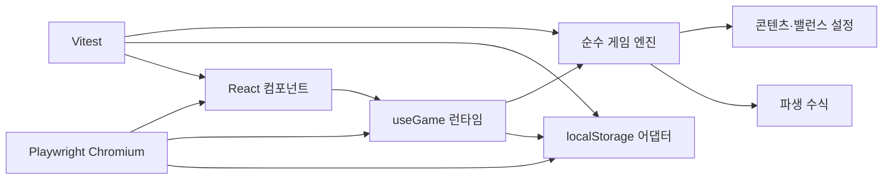

# 기술 아키텍처

## 1. 방향

React는 화면과 브라우저 생명주기만 담당하고, 게임 규칙은 DOM·타이머·저장소를 모르는 순수 TypeScript 함수로 유지한다.



의존 방향은 `UI → 런타임 → 도메인`이며, `src/game`은 React를 import하지 않는다.

## 2. 상태 계약

`GameState`는 저장 가능한 최소 상태만 가진다.

- `schemaVersion`, `lastSavedAt`
- `rng`: `xorshift32-v1` 최초 seed, 현재 uint32 state, 누적 draw 횟수
- `player`: 레벨, 경험치, 자원, 현재 HP, 강화와 스킬 랭크
- `battle`: 현재·최고 스테이지, 적 HP, 라운드 나머지 시간, 쿨다운, 승패 통계
- `stats`: 평생 골드, 처치, 환생

공격력, 최대 HP, 방어력, 적 능력치, 강화 비용은 저장하지 않고 selector 성격의 순수 함수로 매번 파생한다. 콘텐츠 조정 뒤 오래된 저장에도 새 밸런스가 일관되게 적용된다.

## 3. 상태 전이

핵심 API는 다음과 같다.

```ts
createInitialState(now, seed?): GameState
advanceGame(state, elapsedMs): { state, report }
purchaseUpgrade(state, id): CommandResult
upgradeSkill(state, id): CommandResult
selectStage(state, stage): CommandResult
performPrestige(state): CommandResult
```

- 입력 상태를 수정하지 않고 복제한 다음 새 상태를 반환한다.
- 명령은 성공 여부와 사용자 메시지를 함께 반환한다.
- 전투 보고서는 UI 알림과 오프라인 결과에 쓰며 영속 상태에는 저장하지 않는다.
- 전투 라운드마다 저장된 `xorshift32-v1` state를 정확히 한 번 전진시킨다. 같은 RNG state·게임 상태·경과 시간은 치명타 순서와 최종 결과가 같으며, UI와 비전투 명령은 RNG를 호출하지 않는다.

## 4. 게임 시간

```text
250ms 브라우저 pulse
  → 실제 Date.now 차이 계산
  → 경과 시간을 advanceGame에 전달
  → 1초 미만 나머지를 GameState에 보존
  → 완성된 라운드만 처리
```

`setInterval` 호출 횟수를 게임 시간으로 사용하지 않는다. 백그라운드 탭에서 타이머가 지연되어도 다음 pulse가 실제 차이를 처리한다. 5초마다 저장하고 `visibilitychange(hidden)`와 `pagehide`에서도 정산 후 저장한다.

## 5. 저장과 복구

- legacy 키: `emberwatch.save.v1`
- 현재 슬롯: `emberwatch.save.v2.a`, `emberwatch.save.v2.b`
- 현재 writer envelope: `{ formatVersion: 3, revision, savedAt, state }`; A/B localStorage key 이름은 호환을 위해 `v2.a/b`를 유지한다.
- reader는 legacy envelope v2/schema1을 검증해 메모리에서 schema2로 변환하고, writer만 반대 슬롯에 revision+1의 envelope v3/schema2 checkpoint를 기록한다. envelope v3는 구버전 writer의 미래 포맷 차단 장벽이다.
- 읽은 JSON은 `unknown`에서 시작해 숫자 범위와 필수 중첩 구조를 검사한다.
- 스테이지, HP, 라운드 나머지는 현재 콘텐츠 범위로 정규화한다.
- 유효 envelope 중 가장 높은 revision을 선택한다. 동률이면 `savedAt`, 그래도 같으면 A 슬롯을 우선하며 상태를 필드별로 병합하지 않는다.
- 저장은 현재 승자의 반대 슬롯에 `revision + 1`을 쓰고 같은 원문을 즉시 재읽어 decode한 뒤에만 성공으로 판정한다. 이전 승자는 건드리지 않는다.
- 최신 슬롯이 손상되면 이전 유효 슬롯로 복구한 뒤 손상 슬롯을 새 revision으로 치유하고 화면에 경고한다.
- legacy v1 raw `GameState`는 decode·정규화 후 envelope v3/schema2 A/B 기록이 검증된 경우에만 제거한다.
- 알 수 없는 미래 envelope `formatVersion`, envelope 내부 state schema, legacy raw state schema 중 하나라도 발견하면 구버전·현재 클라이언트가 덮어쓰지 않도록 모든 저장을 차단한다.
- 저장 실패는 게임 루프를 중단시키지 않고 상태 표시로 노출한다.
- 브라우저는 `emberwatch.writer.v1` Web Lock을 bootstrap 전에 획득한 한 탭만 writer로 사용한다. 다른 탭은 오프라인 정산·tick·명령·저장 없이 검증된 최신 슬롯을 표시한다.
- writer는 마지막 성공 revision을 추적하고 모든 쓰기에 기대 revision을 전달한다. 불일치나 동일 revision의 divergent 상태는 슬롯을 바꾸지 않고 거부한다.
- reader는 `storage` 이벤트로 최신 snapshot을 반영하며 1초마다 lock 인계를 재시도한다. Web Locks 미지원 환경은 데이터 보호를 위해 읽기 전용이다.
- 진행 초기화는 키를 물리적으로 지우지 않고 초기 상태를 연속 두 revision으로 기록해 단조 revision과 A/B 복구본을 모두 유지한다.
- portable backup v1은 `{ kind, exportVersion, exportedAt, state, checksum }` JSON이며 local envelope revision을 포함하지 않는다. parser는 1 MiB 상한, checksum, 공용 state decoder를 모두 통과한 뒤에만 preview를 만든다.
- import는 preview 확인 시점에도 checksum과 schema를 재검증하고 기대 local revision으로 반대 슬롯에 기록한다. 외부 revision을 복사하지 않으며 `lastSavedAt`을 확인 시각으로 옮겨 과거 오프라인 구간을 재생하지 않는다.
- target write 뒤 read-back이 실패하면 쓰기 전 target 원문을 복원해 실패한 import가 다음 bootstrap의 winner가 되지 않게 한다.

schema migration registry는 GameState schema1을 고정 필드 순서의 FNV-1a seed와 RNG state가 있는 schema2로 변환한다. raw legacy, envelope v2, portable export v1은 같은 decoder를 사용하며 새 시각이나 알 수 없는 필드를 seed에 섞지 않는다. checked-in raw/portable schema1 fixture는 이후 버전에서도 회귀 대상으로 유지한다.

Playwright는 저장 키나 도메인 함수를 직접 호출하지 않는다. 격리된 브라우저 context에서 고정된 `Date.now`와 실제 UI 명령을 사용해 신규 시작, 강화, reload, 페이지 종료, 오프라인 정산을 검증한다. 따라서 React 생명주기와 A/B localStorage 경로를 함께 통과한다.

## 6. 불변식

- HP, 경험치, 재화, 쿨다운, 통계는 유한하고 0 이상이다.
- 현재 스테이지는 `1..MAX_STAGE`, 최고 스테이지 이하이다.
- 적 HP는 현재 적 최대 HP 이하이며 로드 후 최소 1이다.
- 구매는 비용이 충분할 때만 차감과 레벨 상승을 함께 수행한다.
- 보상은 한 처치 분기에서 한 번만 지급한다.
- 오프라인 경과 시간은 8시간을 넘지 않고 음수가 아니다.
- 환생 유지·초기화 필드는 명시적으로 분리한다.

## 7. 확장 지점

- 콘텐츠: `content.ts`의 데이터 정의와 적 생성기
- 경제: `formulas.ts`
- 신규 명령: `engine.ts`의 순수 `CommandResult`
- 저장 교체: `StorageLike` 계약을 구현하는 IndexedDB/서버 어댑터
- 대규모 오프라인 계산: 이벤트 점프 알고리즘 또는 Web Worker
- 서버 운영: 인증·서버 시간·보상 멱등 키·원격 콘텐츠 버전이 선행 조건
